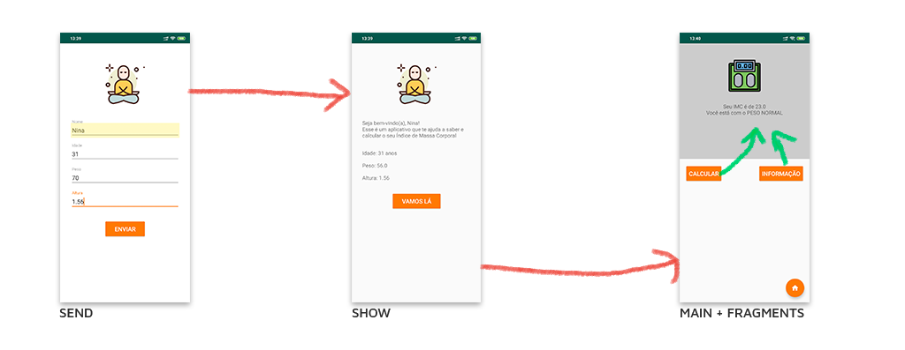

# Resolução do desafio de calculadora de IMC



Para este desafio, foi preciso não passar apenas dados entre activities, mas também para fragmentos. As setas vermelhas foram feitas com comunicação entre activities, e as verdes tem a comunicação entre fragments.

### SendActivity
- Pega os dados dos inputs, cria um objeto Pessoa e passa para a ShowActivity com bundle via intent.

```
btnEnviar.setOnClickListener(new View.OnClickListener() {
            @Override
            public void onClick(View view) {
                String nome = inputNome.getEditText().getText().toString();
                Integer idade = Integer.parseInt(inputIdade.getEditText().getText().toString());
                Double peso = Double.parseDouble(inputPeso.getEditText().getText().toString());
                Double altura = Double.parseDouble(inputAltura.getEditText().getText().toString());

                Pessoa pessoa = new Pessoa(nome, idade, peso, altura);

                Intent intent = new Intent(SendActivity.this, ShowActivity.class);
                Bundle bundle = new Bundle();
                bundle.putParcelable(PESSOA_KEY, pessoa);
                bundle.putInt(IMAGEM_KEY, R.drawable.imgprofile); //passa a imagem, nao o ID do imageView
                intent.putExtras(bundle);

                startActivity(intent);
            }
        });
```

### ShowActivity
- Recebe os dados do bundle via intent, exibe em TextViews e transmite para a MainActivity via um novo bundle e intent.

```
Intent intent = getIntent();

        if (intent != null && intent.getExtras() != null) {
            Bundle bundle = intent.getExtras();

            pessoa = bundle.getParcelable(PESSOA_KEY);
            Integer imagem = bundle.getInt(IMAGEM_KEY);
            String boasVindas = "Seja bem-vindo(a), %s!\nEsse é um aplicativo que te ajuda a saber e calcular o seu Índice de Massa Corporal";

            if (pessoa != null) {
                displayNome.setText(String.format(Locale.US, boasVindas, pessoa.getNome()));
                displayIdade.setText(String.format(Locale.US, "Idade: %d anos", pessoa.getIdade()));
                displayPeso.setText(String.format(Locale.US, "Peso: %.1f", pessoa.getPeso()));
                displayAltura.setText(String.format(Locale.US, "Altura: %.2f", pessoa.getAltura()));
                displayImage.setImageResource(imagem); //puxa da imagem, não do ID da ImageView
            }

            btnVamosLa.setOnClickListener(new View.OnClickListener() {
                @Override
                public void onClick(View view) {
                    //Envia o objeto Pessoa para a MainActivity
                    Intent intent = new Intent(ShowActivity.this, MainActivity.class);
                    Bundle bundle = new Bundle();

                    Pessoa pessoaDados = new Pessoa(pessoa.getPeso(), pessoa.getAltura());

                    bundle.putParcelable(DADOS_KEY, pessoaDados);
                    intent.putExtras(bundle);

                    startActivity(intent);
                }
            });
        }
```

### MainActivity
- Recebe os dados da Pessoa do bundle via intent.
- Para a ação dos botões do CalculoFragment, criei o objeto Opcao, que tem a imagem e o texto que serão exibidos no CalculoFragment
- Opcao vai ser enviado pela interface Comunicador
- O método da interface receberá um bundle com um Parcelable do objeto Opcao, **mas também inclui um Parcelable com a Pessoa recebida, com uma nova chave**. Além disso, cria uma instância do CalculoFragment com esses dados e faz o replaceFragment.

```
@Override
    protected void onCreate(Bundle savedInstanceState) {
        super.onCreate(savedInstanceState);
        setContentView(R.layout.activity_main);

        replaceFragment(R.id.container_down, new BotoesFragment());

        btnHome = findViewById(R.id.botao_home);

        Intent intent = getIntent();

        if (intent != null && intent.getExtras() != null) {
            Bundle bundle = intent.getExtras();

            pessoaDados = bundle.getParcelable(DADOS_KEY);
        }

        btnHome.setOnClickListener(new View.OnClickListener() {
            @Override
            public void onClick(View view) {
                startActivity(new Intent(MainActivity.this, SendActivity.class));
            }
        });
    }

    //Manda como um extra o objeto Pessoa, recebido pelo bundle da intent gerada em ShowActivity
    public void setOptionToFragment(Opcao opcao, String CHAVE) {
        Bundle bundle = new Bundle();
        bundle.putParcelable(CHAVE, opcao);
        bundle.putParcelable(PA_KEY, pessoaDados);
        Fragment calculoFragment = new CalculoFragment();
        calculoFragment.setArguments(bundle);
        replaceFragment(R.id.container_up, calculoFragment);
    }

    public void replaceFragment(int container, Fragment fragment) {
        FragmentManager manager = getSupportFragmentManager();
        FragmentTransaction transaction = manager.beginTransaction();
        transaction.replace(container, fragment);
        transaction.commit();
    }

    @Override
    public void recebeMensagem(Opcao opcao) {
        setOptionToFragment(opcao, OPCAO_KEY);
    }
```

### BotoesFragment
- Cada botão cria uma Opcao com a imagem e o texto de exibição. Como no caso do btnCalcular quero mostrar o resultado do calculo, passei apenas "calculo" na String.
- Chamo o comunicador com o recebeMensagem e envio o objeto criado.

```
 btnCalcular.setOnClickListener(new View.OnClickListener() {
            @Override
            public void onClick(View view) {
                Opcao calculo = new Opcao(R.drawable.imgcalculo, "calculo");

                if (comunicador != null) {
                    comunicador.recebeMensagem(calculo);
                }

            }
        });

        btnInformacao.setOnClickListener(new View.OnClickListener() {
            @Override
            public void onClick(View view) {
                Opcao informacoes = new Opcao(R.drawable.imginfo, "O IMC (Índice de Massa Corporal) é uma ferramenta usada para detectar casos de obesidade ou desnutrição, principalmente em estudos que envolvem grandes populações.");

                if (comunicador != null) {
                    comunicador.recebeMensagem(informacoes);
                }
            }
        });
```

### CalculoFragment

- Recebe os dados e extrai ambos os objetos Opcao e Pessoa
- Verifica qual mensagem tem a String "calculo" e seta o texto com o resultado do cálculo, feito em um método que retorna a mensagem como String.

```
if (!getArguments().isEmpty()) {
            Pessoa pessoaDados = getArguments().getParcelable(PA_KEY);
            Opcao opcao = getArguments().getParcelable(OPCAO_KEY);

            if (opcao != null) {

                Drawable drawable = getResources().getDrawable(opcao.getImagem());
                imgFragment.setImageDrawable(drawable);

                //Se o texto do objeto opcao for "calculo", ele sera desconsiderado para o setText e sera inserido o calculo do IMC
                if (opcao.getTexto() == "calculo") {
                    textoResultado.setText(calcularImc(pessoaDados.getPeso(), pessoaDados.getAltura()));
                } else {
                    //O botao de informacao cai aqui, ele vai setar o que foi passado no objeto
                    textoResultado.setText(opcao.getTexto());
                }

            } else {
                Snackbar.make(container, "Não há dados!", Snackbar.LENGTH_LONG).show();
            }
        }
```


## Passando imagens

É até possível passar uma imagem de uma ImageView buscando pelo ID da ImageView. Neste processo, se passa todo o Bitmap da imagem, mas **não é recomendável**.

A solução foi enviar a imagem diretamente no bundle (do tipo int, dentro ou fora de um objeto):

```
//Note que envia um drawable, não um id

bundle.putInt(IMAGEM_KEY, R.drawable.imgprofile); 
```

Para recuperar ela na activity de destino:

```
Integer imagem = bundle.getInt(IMAGEM_KEY);

displayImage.setImageResource(imagem);
```

